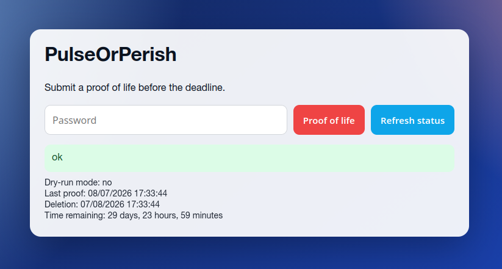
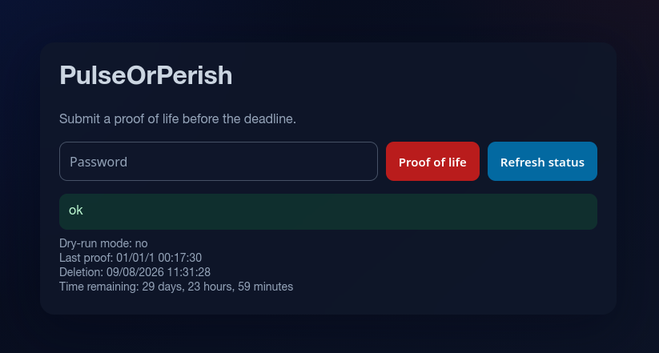

# PulseOrPerish

[](https://github.com/jerome-labidurie/PulseOrPerish/actions/workflows/ci.yml)
[](https://github.com/jerome-labidurie/PulseOrPerish/actions/workflows/release.yml)
[](https://github.com/jerome-labidurie/PulseOrPerish/releases/latest)
[](https://github.com/jerome-labidurie/PulseOrPerish/pkgs/container/pulseorperish)

Dead man switch in Go.

Protect what matters with a simple heartbeat: as long as you are alive, your data stays safe; if you stop checking in, **PulseOrPerish** automatically wipes the target directory. Lightweight, self-hosted, and ready in minutes with a web UI, API, and container support.

## Features
- HTTP User Interface to submit proof-of-life with a password
- REST API with same capabilities
- Persistent heartbeat state surviving container restarts
- Automatic data directory content wipe when deadline is exceeded
- Configurable via CLI flags and environment variables
- Distroless-compatible container image
- Dark mode

<p>
  <a href="./img/webui_light.png">
    
  </a>
  <a href="./img/webui_dark.png">
    
  </a>
</p>

## Configuration
Priority: flags > environment variables > defaults.

| Description | Env variable | Flag | Default | Values / Example |
|---|---|---|---|---|
| Authentication password | `POP_PASSWORD` | `--password` | *(required)* | `mysecret` |
| Interval between proofs | `POP_INTERVAL` | `--interval` | `720h` | `24h`, `720h` ([format](https://pkg.go.dev/time#ParseDuration)) |
| Dry-run mode (no deletion) | `POP_DRY_RUN` | `--dry-run` | `false` | `true`, `false` |
| Directory to wipe on deadline | `POP_DATA_DIR` | `--data-dir` | *(required)* | `/data` (absolute path) |
| Directory for state persistence | `POP_STATE_DIR` | `--state-dir` | `/state` | `/var/lib/pop/state` |
| Log directory | `POP_LOG_PATH` | `--log-path` | (stdout only) | `/var/log/pop/` (directory; if set, a timestamped file is also created) |
| Log level | `POP_LOG_LEVEL` | `--log-level` | `info` | `debug`, `info`, `warn`, `error` |
| HTTP listen address | `POP_LISTEN` | `--listen` | `:8080` | `:8086`, `0.0.0.0:8080` |

## Home Assistant
See [homeassistant.md](./homeassistant.md) for a REST sensor example that imports the remaining time into Home Assistant.

## API
- `GET /` no auth, HTTP UI
- `GET /health` no auth
- `GET /status` no auth
- `POST /alive` auth required

Authentication can be done via 2 methods:
* Header: `Authorization: Bearer <password>`
* json data: `{"password":"<password>"}`

## API examples
```bash
BASE_URL="http://localhost:8086"
PASSWORD="mysecret"
```

Health check:
```bash
curl -s "$BASE_URL/health"
```

Public status:
```bash
curl -s "$BASE_URL/status" | jq .
```

Proof of life (auth required):
```bash
curl -s -X POST "$BASE_URL/alive" \
  -H "Authorization: Bearer $PASSWORD"
# or
curl -s -X POST "$BASE_URL/alive" \
  -H "Content-Type: application/json" \
  --data '{"password":"'${PASSWORD}'"}'
```

## Run locally
```bash
mkdir /tmp/pop-data
go run ./cmd/pulseorperish \
  --listen=':8086' \
  --password='mysecret' \
  --data-dir='/tmp/pop-data' \
  --state-dir='/tmp/pop-state' \
  --dry-run='true' \
  --interval='5m'
```

## Tests
All tests:
```bash
go test ./...
```

End-to-end tests:
```bash
go test ./internal/testkit/e2e -v -timeout 30m
```

## Build container
```bash
docker build -t pulseorperish:local .
```

## Example docker run

You can also use the [docker-compose](./docker-compose.yml) example

```bash
docker run --rm -it -p 8086:8080 \
  -e POP_PASSWORD=mysecret \
  -e POP_DATA_DIR=/data \
  -e POP_STATE_DIR=/state \
  -v $(pwd)/demo-data:/data \
  -v $(pwd)/demo-state:/state \
  ghcr.io/jerome-labidurie/pulseorperish:latest
```
