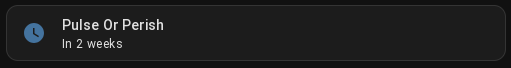
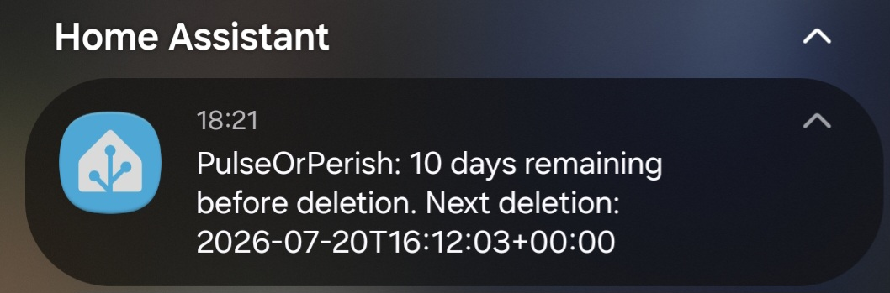

# Home Assistant Integration

This guide shows how to expose the remaining time from PulseOrPerish as a sensor in Home Assistant.



It uses the [RESTful Sensor](https://www.home-assistant.io/integrations/sensor.rest/) integration with the public `GET /status` endpoint.

This guide only covers the sensor configuration and the templating needed to turn the JSON response into a Home Assistant-friendly value.

## PulseOrPerish Status Payload

The `GET /status` endpoint returns a JSON object similar to this:

```json
{
  "lastProofAt": "2026-07-09T18:00:00Z",
  "nextDeletion": "2026-07-10T18:00:00Z",
  "timeRemaining": "23h58m12s",
  "timeRemainingMinutes": 1439,
  "overdue": false,
  "dryRun": false
}
```

Relevant fields for Home Assistant:

- `timeRemainingMinutes` is the numeric value intended for the Home Assistant sensor state.
- `timeRemaining` is the original Go duration.
- `nextDeletion` and `lastProofAt` are useful as sensor attributes.
- `overdue` and `dryRun` can also be exposed as attributes.

## REST Sensor Configuration

Add a REST sensor that polls the public `/status` endpoint and uses `nextDeletion` as the entity state.

Replace `YOUR_HOST:8080` with your real hostname/ip address.

```yaml
sensor:
  - platform: rest
    name: PulseOrPerish Deletion Time
    unique_id: pulseorperish_deletion_time
    device_class: timestamp
    resource: http://YOUR_HOST:8080/status
    method: GET
    scan_interval: 300 # in seconds
    value_template: "{{ value_json.nextDeletion }}"
    json_attributes:
      - lastProofAt
      - overdue
      - dryRun
```

## Automation: Alerts at 10d, 5d and 1d

The example below uses one automation with three [Template triggers](https://www.home-assistant.io/docs/automation/trigger/#template-trigger) and shared actions.



Each alert sends:
- a notification to your mobile app
- a persistent notification in the Home Assistant interface

Replace `notify.MOBILE_APP_YOUR_PHONE` with your real mobile notify entity.

```yaml
automation:
  - id: pulseorperish_notify_before_deletion
    alias: PulseOrPerishNotifications
    description: Sends mobile + HA UI notifications at T-10, T-5 and T-1 days.
    triggers:
      - id: t_minus_10d
        trigger: template
        value_template: >-
          {{ now().timestamp() > (as_timestamp(states('sensor.pulseorperish_deletion_time')) -
          (10*24*60*60)) }}
      - id: t_minus_5d
        trigger: template
        value_template: >-
          {{ now().timestamp() > (as_timestamp(states('sensor.pulseorperish_deletion_time')) -
          (5*24*60*60)) }}
      - id: t_minus_1d
        trigger: template
        value_template: >-
          {{ now().timestamp() > (as_timestamp(states('sensor.pulseorperish_deletion_time')) -
          (1*24*60*60)) }}
    actions:
      - variables:
          days_left: >-
            {{ ((as_timestamp(states('sensor.pulseorperish_deletion_time')) - now().timestamp()) / (24*60*60)) | round(0, 'ceil') }}
          severity_label: >-
            
            {{ map.get(trigger.id, 'warning') }}
          message: >-
            PulseOrPerish: {{ days_left }} day{{ '' if days_left in ['1', 1] else 's' }} remaining before deletion.
            Next deletion: {{ states('sensor.pulseorperish_deletion_time') }}
      - action: notify.send_message
        target:
          entity_id: notify.MOBILE_APP_YOUR_PHONE
        data:
          message: "{{ message }}"
      - action: notify.persistent_notification
        data:
          title: PulseOrPerish {{ severity_label }}
          message: "{{ message }}"
    mode: single
```
